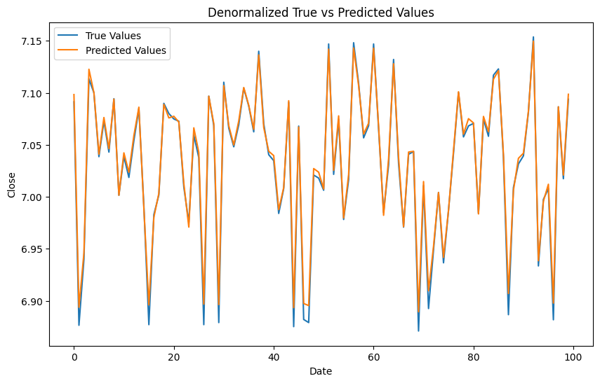

本项目针对[该项目](https://github.com/ZWN2001/CNN-BiLSTM-Attention-K-Line-Prediction)的模型进行基于丢番图逼近的参数优化


$$
x_1,x_2,...,x_k
$$

$$
a_1,a_2,...a_k,b\\
$$

$$
x^2+y^2=z^2
$$


所优化的模型结构：

```
__________________________________________________________________________________________________
 Layer (type)                Output Shape                 Param #   Connected to                  
==================================================================================================
 input_9 (InputLayer)        [(None, 20, 4)]              0         []                            
                                                                                                  
 conv1d_8 (Conv1D)           (None, 20, 64)               320       ['input_9[0][0]']             
                                                                                                  
 batch_normalization_8 (Bat  (None, 20, 64)               256       ['conv1d_8[0][0]']            
 chNormalization)                                                                                 
                                                                                                  
 dropout_16 (Dropout)        (None, 20, 64)               0         ['batch_normalization_8[0][0]'
                                                                    ]                             
                                                                                                  
 bidirectional_5 (Bidirecti  (None, 20, 128)              66048     ['dropout_16[0][0]']          
 onal)                                                                                            
                                                                                                  
 batch_normalization_9 (Bat  (None, 20, 128)              512       ['bidirectional_5[0][0]']     
 chNormalization)                                                                                 
                                                                                                  
 dropout_17 (Dropout)        (None, 20, 128)              0         ['batch_normalization_9[0][0]'
                                                                    ]                             
                                                                                                  
 dense_12 (Dense)            (None, 20, 128)              16512     ['dropout_17[0][0]']          
                                                                                                  
 attention_vec (Permute)     (None, 20, 128)              0         ['dense_12[0][0]']            
                                                                                                  
 multiply_4 (Multiply)       (None, 20, 128)              0         ['dropout_17[0][0]',          
                                                                     'attention_vec[0][0]']       
                                                                                                  
 flatten_8 (Flatten)         (None, 2560)                 0         ['multiply_4[0][0]']          
                                                                                                  
 dense_13 (Dense)            (None, 4)                    10244     ['flatten_8[0][0]']           
                                                                                                  
==================================================================================================
Total params: 93892 (366.77 KB)
Trainable params: 93508 (365.27 KB)
Non-trainable params: 384 (1.50 KB)
```

原始模型性能：



```
MAE: 0.0051256491632018526
MSE: 5.765470677925419e-05
涨跌准确率: 98.72405256141687%
```

使用丢番图逼近优化后：


```
MAE: 0.006580653706453999
MSE: 6.83419583855025e-05
涨跌准确率: 98.57170062845172%
```

使用TFLite量化


```
MAE: 0.0051256513903547435
MSE: 5.765476461225458e-05
涨跌准确率: 98.72405256141687%
```

### 涉及的模型结构分析及丢番图逼近优化潜力

#### 1. **`Conv1D` 层**

- 作用：1D 卷积层提取局部特征，参数量由卷积核大小、输入通道数和输出通道数决定。
  - 参数量公式：`(kernel_size × 输入通道数 × 输出通道数) + 输出通道数`。
  - 模型中参数量：`(3 × 4 × 64) + 64 = 320`。
- 优化潜力：
  - `Conv1D` 层的权重矩阵可以通过丢番图逼近进行优化，因为卷积核权重通常可以以低精度表示（即使用分数逼近浮点数）。
  - 此层参数量较少（320），优化的效果有限，但可以通过丢番图逼近减少计算开销。

------

#### 2. **`BatchNormalization` 层**

- 作用：对每个通道进行归一化，稳定训练并加速收敛。
  - 参数量公式：`2 × 输出通道数`（缩放参数和偏移参数）。
  - 两个 BatchNormalization层的参数量分别是：
    - 第一层：`2 × 64 = 128`。
    - 第二层：`2 × 128 = 256`。
- 优化潜力：
  - `BatchNormalization` 层的参数量较小（总计 384），优化潜力有限。
  - 可以通过丢番图逼近表示缩放和偏移参数为低精度分数，但这对整体性能和存储的影响很小。

------

#### 3. **`Dropout` 层**

- **作用**：随机丢弃神经元以防止过拟合。
- **参数量**：无参数，仅在训练时启用。
- **优化潜力**：无需优化。

------

#### 4. **`Bidirectional` 层**

- 作用：双向 LSTM 处理序列数据，捕捉前向和后向的时间依赖关系。
  - 参数量公式（LSTM）：`4 × [(隐藏单元数 × (输入维度 + 隐藏单元数)) + 隐藏单元数]`。
  - 在模型中，双向层包含两个 LSTM，每个 LSTM 隐藏单元数为 64：
    - 参数量：`4 × [(64 × (64 + 64)) + 64] = 66048`。
- 优化潜力：
  - 这是模型中参数量最多的层，占总参数量的 **70.36%**，需要重点优化。
  - 可以对 LSTM 的权重矩阵（输入门、遗忘门、输出门等）进行低秩分解，并用丢番图逼近表示权重值为低精度分数。
  - 此外，可以稀疏化部分权重，减少参数量。

------

#### 5. **`Dense` 层**

- 作用：全连接层，用于特征变换和输出预测。
  - 第一层参数量：`128 × 128 = 16512`。
  - 第二层参数量：`2560 × 4 = 10244`。
  - 总参数量：`16512 + 10244 = 26756`。
- 优化潜力：
  - 密集权重矩阵可以通过丢番图逼近减少浮点数精度。
  - 参数量较高，尤其是第一层（16512），这是需要优化的重点之一。

------

#### 6. **`Attention` 层（`Permute` 和 `Multiply`）**

- **作用**：实现自定义注意力机制，通过权重调整输入特征的重要性。
- **参数量**：无额外参数。
- **优化潜力**：无需优化。

------

#### 7. **`Flatten` 层**

- **作用**：将高维张量展开为一维。
- **参数量**：无参数。
- **优化潜力**：无需优化


## 使用连分数进行精度控制

```python
from fractions import Fraction
import math

def round_to_n_significant_digits(num, n):
    """
    保留 n 位有效数字的函数。
    
    参数:
    - num: 要处理的数字 (float 或 int)。
    - n: 要保留的有效数字位数 (正整数)。

    返回:
    - 保留 n 位有效数字的数字。
    """
    if num == 0:
        return 0  # 对于 0，直接返回 0
    else:
        # 计算有效数字所需的小数位数
        shift = n - int(math.floor(math.log10(abs(num)))) - 1  # 数字的数量级调整
        return round(num, shift)
    
def approximate_with_rational(matrix, precision):
    """
    使用连分数逼近量化矩阵中的浮点数，动态调整分母限制。

    参数:
        matrix (np.ndarray): 原始浮点数矩阵，可以是多维矩阵。
        max_denominator (int): 逼近的分母最大值。默认值为100。

    返回:
        np.ndarray: 量化后的矩阵，元素为 Fraction 类型。
    """

    # 映射函数：根据数值的大小映射出对应的最大分母限制
    def map_to_max_denominator(value):
        if value == 0: return 1
        abs_value = abs(value)
        d = 10**precision/abs_value
        d = int(d)
        return d

    def quantize_element(element):
        if isinstance(element, np.ndarray):  # 如果是子数组，递归处理
            return np.array([quantize_element(sub_elem) for sub_elem in element], dtype=object)
        else:
            # 使用映射函数来动态获取该元素的最大分母
            dynamic_denominator = map_to_max_denominator(element)
            # 量化该元素
            return Fraction(str(element)).limit_denominator(dynamic_denominator)

    return quantize_element(matrix)


# 递归地将量化后的权重矩阵中的每个 Fraction 转换为浮点数
def convert_fractions_to_floats(element, precision):
    if isinstance(element, np.ndarray):  # 如果是子数组，递归处理
        return np.array([convert_fractions_to_floats(sub_elem, precision) for sub_elem in element])
    elif isinstance(element, Fraction):  # 如果是分数，转换为浮点数
        return round_to_n_significant_digits(float(element),precision)
    else:
        raise TypeError

quantized_weights_map = {}
quantized_float_weights_map = {}

precision_map={
    "conv1d": 4,
    "bidirectional": 2,
    "dense": 2,
    "dense_1": 4
}

for key, value in widgets_map.items():
    layer_name = key.split('-')[0]
    print(f"层名称: {layer_name}")
    if layer_name in precision_map:
        print(f"原始权重矩阵:\n{value}")
        quantized_weights = approximate_with_rational(value, precision=precision_map[layer_name]) # 使用precision控制精度（类似于保留位数，这里意味着前precision位有效数字是准确的
        print(f"量化后的权重矩阵:\n{quantized_weights}")
        quantized_weights_map[key] = quantized_weights
        float_weights = convert_fractions_to_floats(quantized_weights, precision=precision_map[layer_name] * 2) # 使用precision * 2来保留有效数字
        print(f"转换为浮点数的权重矩阵:\n{float_weights}")
        quantized_float_weights_map[key] = float_weights
    else:
        quantized_float_weights_map[key] = value

```

涉及策略如下：

- 采用 $y_{d}=\frac{10^{p}}{|value|}$ 作为分母限制，思想类似于保留的有效数字位数，这里意味着前`p`位有效数字是准确的

- 同时对原有参数的有效数字位数进行限制，这里`p~2p`位的数字被保留

- 使用`precision_map`对不同层的优化策略进行自定义，对于参数量大的层采用低精度量化


对于大模型：

### 参数分析：模型中参数的分布与作用

大型语言模型（如GPT-3）中的参数主要分布在以下几个部分，每个部分的参数对模型性能起着不同的作用：

------

#### 1. **嵌入层（Embedding Layer）**

- 参数分布：嵌入层映射输入词汇到一个高维向量空间，参数量与词汇表大小和嵌入维度相关。
  - 参数量公式：`词汇表大小 × 嵌入维度`
- **作用**：嵌入层参数是语言模型的“记忆库”，用于捕捉词汇的语义和上下文。
- 优化潜力：
  - 词嵌入矩阵中可能存在稀疏性或冗余（例如部分词的表示可能高度相关），可以通过丢番图逼近，对词嵌入向量进行有理数近似，减少其精度表示和存储成本。

------

#### 2. **自注意力层（Self-Attention Layers）**

- 参数分布：自注意力层参数包括查询（Query）、键（Key）、值（Value）矩阵和输出投影矩阵，参数量与模型隐藏维度和头数有关。
  - 参数量公式：`4 × (隐藏维度 × 隐藏维度)`
- **作用**：捕捉输入之间的长距离依赖关系，是模型性能的核心部分。
- 优化潜力：
  - 线性变换矩阵（如`W_q`, `W_k`, `W_v`）中的权重可能存在冗余或低秩特性，可通过丢番图逼近优化这些权重矩阵的存储和计算精度。
  - 对于多头注意力机制，可以通过逼近参数共享机制来减少头部之间的冗余。

------

#### 3. **前馈网络层（Feedforward Layers）**

- 参数分布：前馈层通常是一个两层全连接网络，参数量与隐藏维度和前馈网络维度相关。
  - 参数量公式：`2 × (隐藏维度 × 前馈维度)`
- **作用**：执行特征变换，捕捉非线性关系。
- 优化潜力：
  - 前馈网络参数矩阵中，权重可能存在近似稀疏性或低秩特性，可以通过丢番图逼近减少权重值的精度。

------

#### 4. **层归一化（Layer Normalization）参数**

- 参数分布：每一层都有归一化参数，包括缩放参数和偏移参数。
  - 参数量公式：`2 × 隐藏维度`
- **作用**：稳定训练过程，加快收敛速度。
- 优化潜力：
  - 归一化参数的优化潜力较小，但仍可通过丢番图逼近减少其浮点数表示的精度。

------

#### 5. **输出层（Output Layer）**

- 参数分布：输出层是一个全连接层，将隐藏状态映射到词汇表，参数量与隐藏维度和词汇表大小有关。
  - 参数量公式：`隐藏维度 × 词汇表大小`
- **作用**：生成概率分布，用于预测下一个词。
- 优化潜力：
  - 输出层权重矩阵通常是模型中参数最大的部分，尤其在词汇表非常大的情况下。可以通过丢番图逼近对权重矩阵进行低精度近似。

